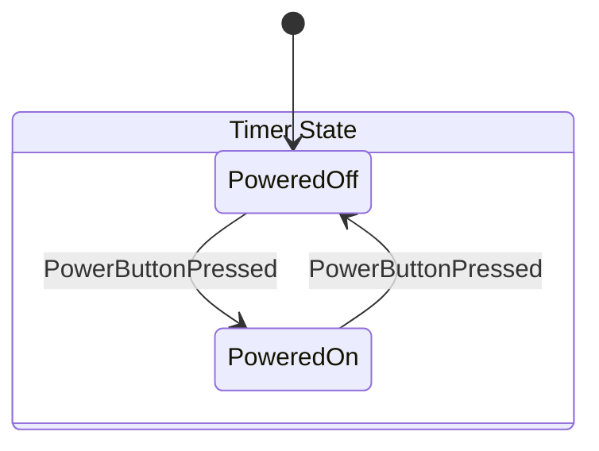

# Timer State Chart

Generated on: 2025-07-28 17:56:52

## State Hierarchy

- **Timer State**
  - **PoweredOff**
  - **PoweredOn**

## Initial States

- **PoweredOff**

## State Transitions

| From State | Input | To State |
|------------|-------|----------|
| PoweredOff | PowerButtonPressed | PoweredOn |
| PoweredOn | PowerButtonPressed | PoweredOff |

## State Diagram

